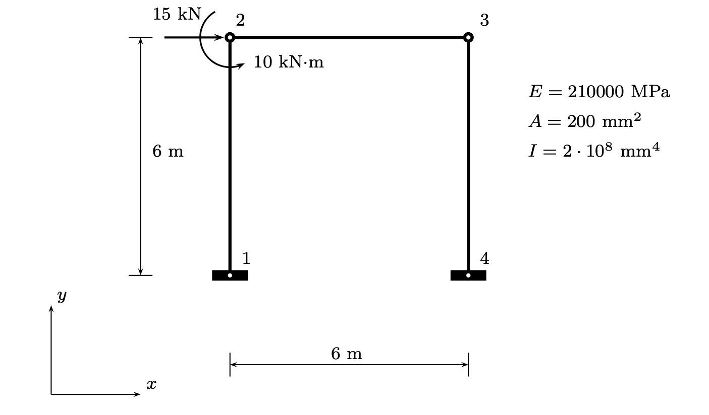
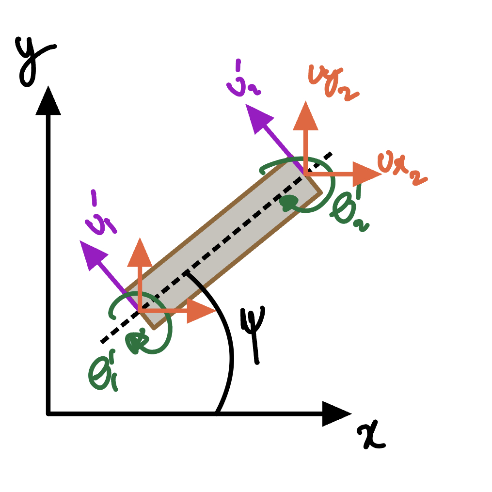

# Three Euler-Bernoulli Beams in 2D
## General formulation in 2D using local beam elements

The geometry schematic is given as

The mass and stiffness matrix are given as 

## Mass and Stiffness matrices
The mass matrix for a single Euler-Bernoulli beam element is given by
$   [M] = 
    \frac{\overline{m}L}{420}
    \begin{bmatrix} 
        156  & 22L   & 54   & -13L  \\ 
        22L  & 4L^2  & 13L  & -3L^2 \\
        54   & 13L   & 156  & -22L  \\ 
        -13L & -3L^2 & -22L & 4L^2 \\ 
    \end{bmatrix}
$
$\overline{m}$ is the mass per unit length, and $L$ is the element length

The stiffness matrix (sym) is
$   [K] = 
    \frac{EI}{L^3}
    \begin{bmatrix} 
        12   & 6L    & -12  & 6L   \\ 
             & 4L^2  & -6L  & 2L^2 \\
             &       & 12   & -6L  \\ 
             &       &      & 4L^2 \\ 
    \end{bmatrix}
$

These are in the local reference frame so that each element has deformation 
normal to its longitudinal axis. 

In order to represent a beam oriented in 2D space, a transformation is required
to move from M and K in local beam reference frame to global reference frame.

The potential energy is written as
$
    P = \{u\}_l^T[{\bf K}]_l\{u\}_l 
$
where the local $\{u\}_l$ is given as
$   \{u\}_l  = 
    \begin{Bmatrix} 
        u_1'      \\ 
        \theta_1' \\
        u_2'      \\ 
        \theta_2' \\ 
    \end{Bmatrix}
$
which is related to deformations in global reference frame $\{u\}$ as
$   \{u\}_l  = [T]\{u\}
$
where the global deformations vector $\{u\}$ is
$   \{u\}  = 
    \begin{Bmatrix} 
        u_{x1}      \\
        u_{y1}      \\ 
        \theta_{z1} \\
        u_{x1}      \\ 
        u_{y2}      \\
        \theta_{z2} \\
    \end{Bmatrix}
$
The transformation matrix is then
$   [T] = 
    \begin{bmatrix} 
        -\sin(\phi)  & \cos(\phi)   & 0   & 0           & 0          & 0 \\ 
        0            & 0            & 1   & 0           & 0          & 0 \\
        0            & 0            & 0   & -\sin(\phi) & \cos(\phi) & 0 \\ 
        0            & 0            & 0   & 0           & 0          & 1 \\ 
    \end{bmatrix}
$
The potential energy can be written as
$
    P = ([T]\{u\})^T[{\bf K}]_l[T]\{u\} = \{u\}^T
        \underbrace{[T]^T[{\bf K}]_l[T])}_{[K]_{global}}\{u\}
$
thus,
$
[K]_g = [T]^T[{\bf K}]_l[T]
$
similarly,
$
[M]_g = [T]^T[{\bf M}]_l[T]
$

## Assembling the matrices
| DOFs     |    0   |  1     | 2           | 3      | 4       | 5            | 6      | 7      |  8          | 9  | 10 | 11
|----------|:------:|:------:|:-----------:|:------:|:-------:|:------------:|:------:|:------:|:-----------:|:--:|:--:|:--:|
| Element $I$|$u_{x1}$|$u_{y1}$|$\theta_{z1}$|$u_{x2}$| $u_{y2}$| $\theta_{z2}$|
| Element $II$|     |        |             |$u_{x1}$| $u_{y1}$| $\theta_{z1}$|$u_{x2}$|$u_{y2}$|$\theta_{z2}$|
| Element $III$|    |        |             |        |         ||$u_{x1}$|$u_{y1}$|$\theta_{z1}$|$u_{x2}$|$u_{y2}$| $\theta_{z2}$|

The system global stiffness matrix is then
$   [K] = 
    \begin{bmatrix} 
        k_{11}^I    & k_{12}^I   & k_{13}^I  & k_{14}^I            & k_{15}^I              & k_{16}^I & 0 & 0 & 0 & 0 & 0 & 0 \\ 
        k_{21}^I    & k_{22}^I   & k_{23}^I  & k_{24}^I            & k_{25}^I              & k_{26}^I & 0 & 0 & 0 & 0 & 0 & 0 \\ 
        k_{31}^I    & k_{32}^I   & k_{33}^I  & k_{34}^I            & k_{35}^I              & k_{36}^I & 0 & 0 & 0 & 0 & 0 & 0 \\ 
        k_{41}^I    & k_{42}^I   & k_{43}^I  & k_{44}^I+k_{11}^{II} & k_{45}^I+k_{12}^{II} & k_{46}^I+k_{13}^{II} & k_{14}^{II} & k_{15}^{II} &k_{16}^{II}& 0 & 0 & 0\\
        k_{51}^I    & k_{52}^I   & k_{53}^I  & k_{54}^I+k_{21}^{II} & k_{55}^I+k_{22}^{II}  & k_{56}^I+k_{23}^{II} & k_{24}^{II}& k_{25}^{II} & k_{26}^{II} & 0 & 0 & 0\\ 
        k_{61}^I    & k_{62}^I   & k_{63}^I  & k_{64}^I+k_{31}^{II} & k_{65}^I+k_{32}^{II}  & k_{66}^I+k_{33}^{II} & k_{34}^{II} & k_{35}^{II} &k_{36}^{II}& 0 & 0 & 0\\ 
        0          & 0           & 0         & k_{41}^{II}          & k_{42}^{II}             & k_{43}^{II}   & k_{44}^{II}+k_{11}^{III}   & k_{45}^{II}+k_{12}^{III}  & k_{46}^{II}+k_{13}^{III} & k_{14}^{III} & k_{15}^{III} & k_{16}^{III} \\ 
        0          & 0           & 0         & k_{51}^{II}         & k_{52}^{II}         & k_{53}^{II}        & k_{54}^{II}+k_{21}^{III}&k_{55}^{II}+k_{22}^{III} & k_{56}^{II}+k_{23}^{III}& k_{24}^{III} & k_{26}^{III} & k_{26}^{III} \\ 
        0          & 0           & 0         & k_{61}^{II}    & k_{62}^{II}    &k_{63}^{II}&k_{64}^{II}+k_{31}^{III} & k_{65}^{II}+k_{32}^{III}   & k_{66}^{II}+k_{33}^{III} & k_{34}^{III} & k_{35}^{III} & k_{36}^{III}  \\ 
        0          & 0           & 0         & 0                   & 0                     & 0       &k_{41}^{III}  & k_{42}^{III}  &  k_{43}^{III} &  k_{44}^{III} &  k_{45}^{III} &  k_{46}^{III} \\
        0          & 0           & 0         & 0                   & 0                     & 0       & k_{51}^{III}  & k_{52}^{III}  & k_{53}^{III}  & k_{54}^{III}  & k_{55}^{III}  & k_{56}^{III}  \\ 
        0          & 0           & 0         & 0                   & 0                     & 0       & k_{61}^{III} & k_{62}^{III} & k_{63}^{III} & k_{64}^{III} & k_{65}^{III} & k_{66}^{III} \\
    \end{bmatrix}_{12\times12}
$

## Newmark solution algorithm for MDOF system

1. Compute the initial displacements, velocities and accelerations. Initial displacement and velocities are the inputs. Initial acceleration can be computed as
$
    [{\bf M}]\{\ddot{u}_0\} = \{F_0\} - [{\bf C}]\{\dot{u}_0\} - [{\bf K}]\{u_0\}
$
In case of non-diagonal mass matrix, this requires solution of linear system (only once at start)

2. Solve the system for each time step. The vector of displacements at the next time step is given as
$
    [a_1{\bf M} + a_2{\bf C} + {\bf K}]\{u_{i+1}\} = \{f_{i+1}\} + 
    [a_1{\bf M} + a_2{\bf C}]\{u_{i}\} +
    [a_3{\bf M} - a_4{\bf C}]\{\dot{u}_{i}\} +
    [a_5{\bf M} - a_6{\bf C}]\{\ddot{u}_{i}\} 
$
Only the above equation requires solution of a linear system to get the vector $\{u_{i+1}\}$ at the next time step. 
Then update the velocities and accelerations
$
    \{\dot{u}_{i+1}\} = a_2\left(\{u_{i+1}\} - \{u_i\}\right) +
    a_4\{\dot{u}_i\} + a_6\{\ddot{u}_i\}
$
$
    \{\ddot{u}_{i+1}\} = a_1\left(\{u_{i+1}\} - \{u_i\}\right) -
    a_3\{\dot{u}_i\} - a_5\{\ddot{u}_i\}
$
where the coefficients are given as (only depends on time step and the fixed params)
$
    a_1 = 1/(\beta \times dt^2) \\
    a_2 = \gamma/(\beta \times dt) \\
    a_3 = 1/(\beta \times dt) \\
    a_4 = 1 - \gamma/\beta \\
    a_5 = 1/(2\beta) - 1 \\
    a_6 = (1 - \gamma/(2\beta))\times dt \\
$
